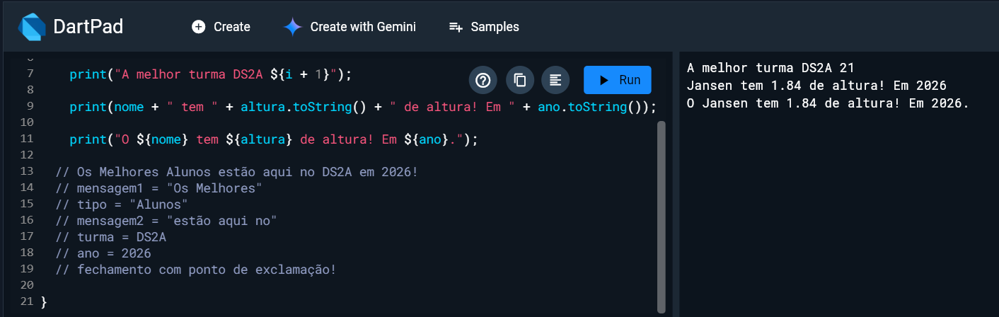

# Meu primeiro Projeto em Dart Flutter

## Professor  🗂️

Nome: Jansen Killinger Cara
Turma: DS2A <br>
Professor: Jansen


Projeto para alunos SENAI e SESI


Aula de comandos básicos em Dart Flutter

```dart
  dart run aula1.dart
```

## Resultado

- jhfçjgdj
- jgkgdflgf

1. jkhjkh
2. hhgj




## As Tecnologias
    - Dart
    - GIT
    - Terminal
    - VScode
    - MarkDown

## O que aprendemos
    - Documentação Dart
    - Criar o README.md
    - Instalamos o GIT
    - Comandos em Dart
    - Fork no GitHub

    void main() {
  var nome = "Jansen";
  var ano = 2026;
  var altura = 1.84;
  
//     print("A melhor turma DS2A ${i + 1}");

//     print(nome + " tem " + altura.toString() + " de altura! Em " + ano.toString());
    
//     print("O ${nome} tem ${altura} de altura! Em ${ano}.");
  
  // Os Melhores Alunos estão aqui no DS2A em 2026!
  // mensagem1 = "Os Melhores"
  // tipo = "Alunos"
  // mensagem2 = "estão aqui no"
  // turma = DS2A
  // ano = 2026
  // fechamento com ponto de exclamação!
  
//   var idade = 17;
  
//   if (idade >= 18){
//    print("Você já é maior de idade!");
//   } else {
//     print ("Você é menor de idade, peça autorização!");
//   }
  
//   dynamic bobe = "Cachorro";
//   print('o meu "bobe" é ${bobe}');
  
//   bobe = 75;
//   print('o meu "bobe" é ${bobe}');

// propriedades dos inteiros:
  
  int numero = 10;
  
  print("O valor de numero  é  par? ${numero.isEven}");
  print("O valor de numero é impar? ${numero.isOdd}");
  
  

}